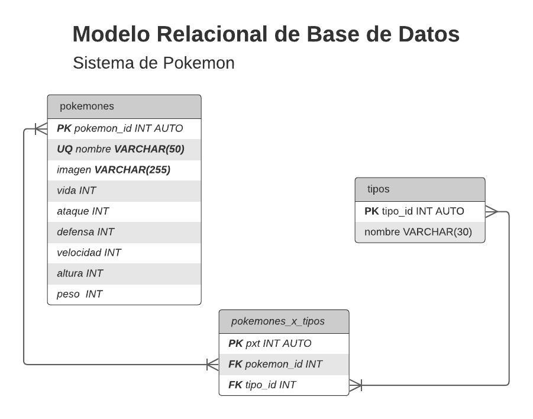

# Pokemon app

# Proyecto realizado por: Joao Bone

# Parte 1: Lógica de Proyecto

## 1) Listado de entidades

### pokemons (Entidad de Datos)

- id (primary key)
- nombre (unique)
- vida
- ataque
- defensa
- velocidad
- altura
- peso
- tipos (foreign key)

### types (Entidad Catálogo)

- id (primary key)
- nombre

### pokemons_x_types (Entidad pivote)

- id (primary key)
- pokemonId (foreign key)
- typeId (foreign key)

## 2) Relaciones

1. **Pokemones** pertenecen a **tipos de pokemons**.
2. **Tipos de pokemon** tienen a **Pokemones**.

#### Diagrama relacional de la base de datos

## 3) Reglas del proyecto

### pokemons

1. Crear un pokemon.
2. Leer a todos los pokemons de un tipo en particular.
3. Leer a un pokemon en particular
4. Eliminar a un pokemon.

### tipos

1. Crear / Conseguir tipos.
2. Leer todos los tipos.
3. Leer un tipo en particular.

### pokemons_x_tipos

1. Crear un pokemon por tipo.
2. Leer los tipos a los que pertenece un pokemon.
3. Eliminar un pokemon por tipo.

# Parte 2: [FALTA]
